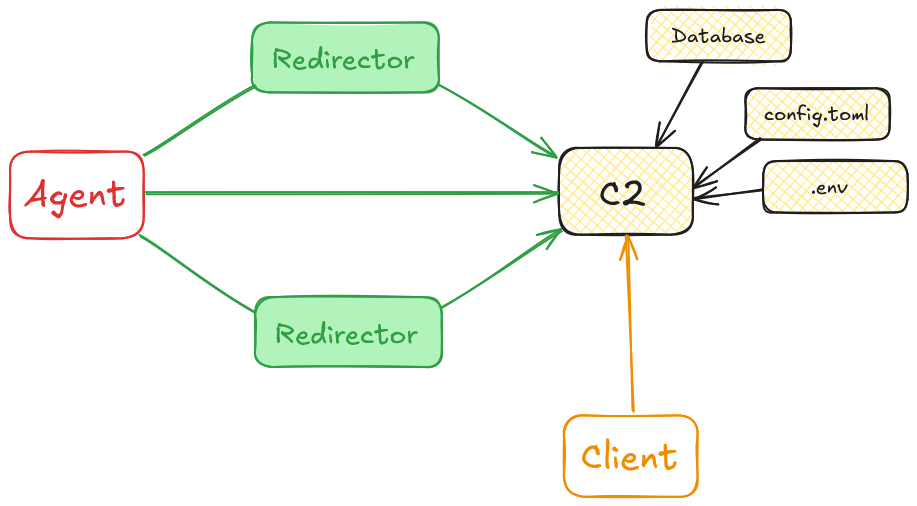
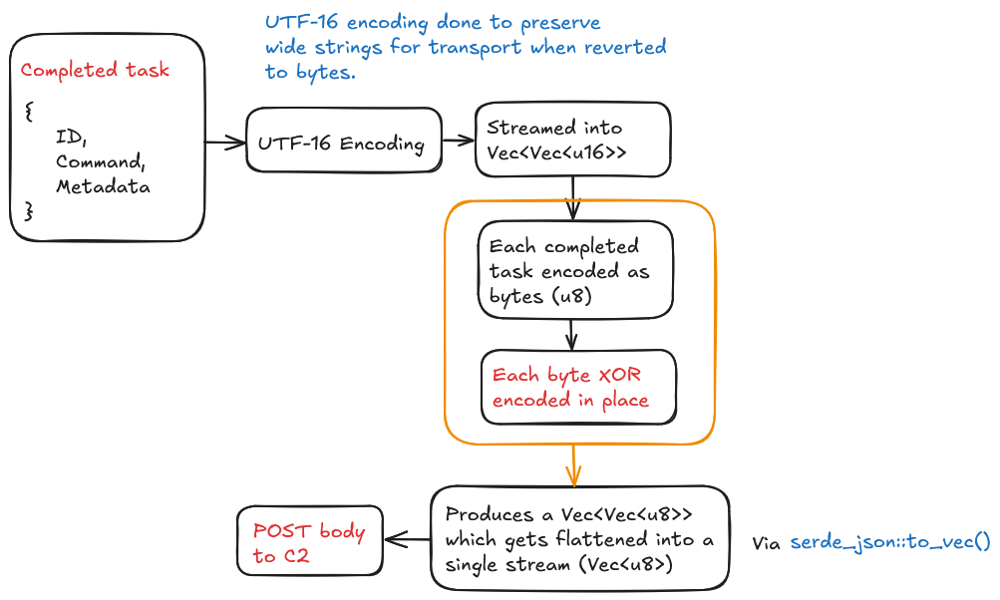

# Wyrm - v0.3 Hatchling

&#128679; Pre-release version &#128679;. If you want to support this project, please give it a star! I will be releasing updates and
devlogs on my [blog](https://fluxsec.red/) and [YouTube](https://www.youtube.com/@FluxSec) to document progress, so please give me a follow there.

**IMPORTANT**: Before pulling updates, check the [Release Notes](https://github.com/0xflux/Wyrm/blob/master/RELEASE_NOTES.md) for any 
breaking changes to profiles / configs which you may need to manually adjust or migrate. This is done especially so that updates do not
overwrite your local configs and agent profiles.

### Post exploitation Red Team framework

Wyrm (pronounced 'worm', an old English word for 'serpent' or 'dragon') is a post exploitation, open source, Red Team security testing framework framework, written in Rust designed to be used by Red Teams, Purple Teams, 
Penetration Testers, and general infosec hobbyists. This project is fully built in Rust, with extra effort going into obfuscating artifacts which
could be present in memory. Project created and maintained by [flux](https://github.com/0xflux/), for **legal authorised security testing only**.

Wyrm currently supports only HTTP(S) agents using a custom encryption scheme for encrypting traffic below TLS, with a unique packet design so that
the packets cannot be realistically decrypted even under firewall level TLS inspection.

This project is a work in progress, currently released at v0.2 (Hatchling). Updates are planned through versions 1,0, 2.0, 3.0, and 4.0. You can view
the planned roadmap in this project (see [Milestones.md](https://github.com/0xflux/Wyrm/blob/master/Milestones.md)). In time, this is designed to be an open source competitor to **Cobalt Strike**, **Mythic**, **Sliver**, etc.

For any bugs, or feature requests, please use the Issues tab, and for anything else - please use GitHub Discussions. I am active on this project,
so I will be attentive to anything raised.

### Features

- Implant uses a configurable profile to customise features and configurations
- IOCs encrypted in the payload to assist in anti-analysis and anti-yara hardening
- Implant transmits data encrypted below TLS, defeating perimeter inspection security tools out the box
- Dynamic payload generation
- Easy mechanism to stage files (such as built implants, PDF, zip, etc) on the C2 for download to support phishing campaigns and initial attack vectors
- Supports native Windows API commands, more planned in future updates
- Easy to use terminal client for the operator to task & inspect agents, and to manage staged resources
- Implant uses the most common User-Agent for comms to help it blend in covertly with traffic by default, this is also configurable to suit your engagement
- Easy, automated C2 infrastructure deployment with `install_server.sh`
- Anti-sandbox techniques which are highly configurable by the operator through profiles
- Backed by a database, fully timestamped to make reporting easier

This project is not currently accepting contributions, please **raise issues** or use **GitHub Discussions** and I will look into them, and help
answer any questions.

**Before deploying the C2**, you should read the C2 readme file, found in the `/c2` directory. Proper docs are coming soon
in time for v1.0 release, at https://wyrm-c2.com.

A mental model for the C2 is as follows:

The below image demonstrates the **Below TLS Encryption** feature and how it is implemented:

### Updates

**WARNING:** Before pulling an update; please check the [release notes](https://github.com/0xflux/Wyrm/blob/master/RELEASE_NOTES.md) to see whether there are any breaking changes - for example if the
**configurable C2 profile** changes in a breaking way from a previous profile you have, you will want to make sure you backup and migrate
your profile. I will be excluding `/c2/profiles/*` from git once the project is published in pre-release to prevent accidentally overwriting
your previous profile when running `git pull` to update your software.

As per the roadmap, this project will see significant development over the next 12 months. To pull updates, whether they are new features
or bug fixes, you simply just do a git pull, re-build the c2 in release mode via:

- `sudo systemctl stop wyrm`
- `cd c2`, 
- `cargo build --release`
- `sudo systemctl start wyrm`

### Setup

The project contains an install shell script, and is designed to be run on `Debian` based Linux flavours.
The install script will install all required dependencies to the project, as well as making a new user, `wyrm_user`
that will run the C2 service.

The user account is created as `sudo useradd --system --no-create-home --shell /usr/sbin/nologin wyrm_user`.

**Server Setup**

1) Install your favourite reverse proxy (NGINX / Apache etc). The web app will default to serve on `0.0.0.0` at `:8080`. You can edit this in `/c2/.env` (at step 2), so configure your reverse proxy to use whatever you define in the `.env`.
2) Clone the repo to your server & mark the install script executable.
3) **SECURITY**: 
   1) In `c2/.env` edit:
      1) `POSTGRES_PASSWORD`
      2) `ADMIN_TOKEN` - **DO NOT USE THE DEFAULT THAT I PROVIDED**!!!!!! Ensure this is **sufficiently** complex. Explanation can be found below.
      3) You can also edit other settings, which provide malleability to your C2.
4) `chmod +x install_server.sh`
5) Run `./install_server.sh` from the **repo directory**, this will install all required dependencies, configure the database, build the C2 etc.
   1) **Optionally**, if you are an expert user and want to use less space on the C2, you can manually configure the installation paths by dropping pre-built (by you, I won't provide pre-build binaries) binaries onto the server in the correct places & configuring the service as appropriate.

**Client Setup**

Simply follow the instructions in the `client` directory, using `docker` to run the GUI. You will need to ensure the admin token (instructions found
within) matches the admin token on the C2 as explained above.

**If running locally**

If you are running locally, and want to use the implant in debug mode (for testing) you will need to log into the C2 and stage a new agent, that matches
the configuration provided in `implant/set_dbg_env.ps1`. You MUST create a new agent staged that accepts the security token defined in that `ps1` file (steps below). The `.ps1` script will just export the build settings to your environment which are compiled into the binary at compile time.

For **SECURITY** I would not recommend doing this on a remote C2 as it would be a 'default bypass' for an adversary. It is fine for your local dev environment
however.

To do this:

1) Run `implant/set_dbg_env.ps1` to export the environment variables required at compile time for the agent.
2) Log into the client (after setting the .env data)
3) Click on the button to stage a new agent.
4) You now need to ensure the two inputs match these instructions
   1) When you are asked for an `Agent name`, enter the name found in your `.ps1` script under the key `$Env:AGENT_NAME`.
   2) When you are asked to `Enter a unique security token for the this payload`, enter the the token you found in your `.ps1` script found in the key: `$Env:SECURITY_TOKEN`.
5) This will create a relevent entry in the database so that you can build in debug mode and test the agent locally, authorizing the connectivity between C2 and agent.

## The legal bit

### Authorized Use Only

**Permitted Users**

The Software is intended **exclusively** for **authorised** penetration testers, Red Teams, Purple Teams, hobbyists, and security researchers who have obtained **explicit, written authorisation from the owner of each target system**.

Any use of the Software on systems for which you do not hold such authorisation is **strictly prohibited** and may constitute a criminal offence under the UK Computer Misuse Act 1990 (including sections on Unauthorised access to computer material, Unauthorised access with intent to commit further offences, and Unauthorised acts impairing operation) or equivalent laws elsewhere.

### Prohibited Conduct
You must not use, distribute, or facilitate use of the Software for:

- Unauthorised Access (CMA 1990, Section 1) — hacking into systems or accounts without permission.
- Unauthorised Modification (CMA 1990, Section 3) — altering, deleting, or corrupting data or programs you have no right to modify.
- Denial-of-Service (CMA 1990, Section 3A) — disrupting or interrupting any service, network, or application.
- Malware/Ransomware Creation — writing, incorporating, or deploying code intended to extort, damage, or hold data hostage.
- Any other malicious, unlawful, or harmful activities.

Or equivalent offenses in other jurisdictions.

**No Encouragement of Misuse:**

The Author expressly **does not condone, support, or encourage** any illegal or malicious activity. This Software is provided purely for legitimate security-testing purposes, in environments where full authorisation has been granted.

### Compliance with Laws & Regulations

**Local Laws**: You alone are responsible for ensuring your use of the Software complies with all applicable local, national, and international laws, regulations, and corporate policies.

### No Warranty

The Software is provided “as is” and “as available”, without warranties of any kind, express or implied.

We make no warranty of merchantability, fitness for a particular purpose, or non-infringement.

We do not warrant that the Software is error-free, secure, or uninterrupted.

### Limitation of Liability

To the fullest extent permitted by law, neither the Author nor contributors shall be liable for any:

- Direct, indirect, incidental, special, punitive, or consequential damages.
- Loss of revenue, profits, data, or goodwill.
- Costs of procurement of substitute goods or services.

This limitation applies even if we have been advised of the possibility of such damages. It is the responsibility of the professional operator to
use this tool safely.