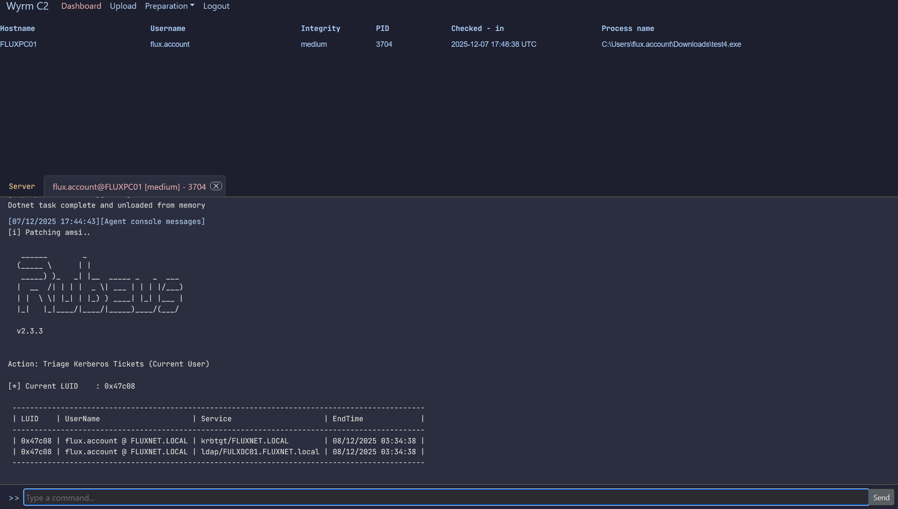
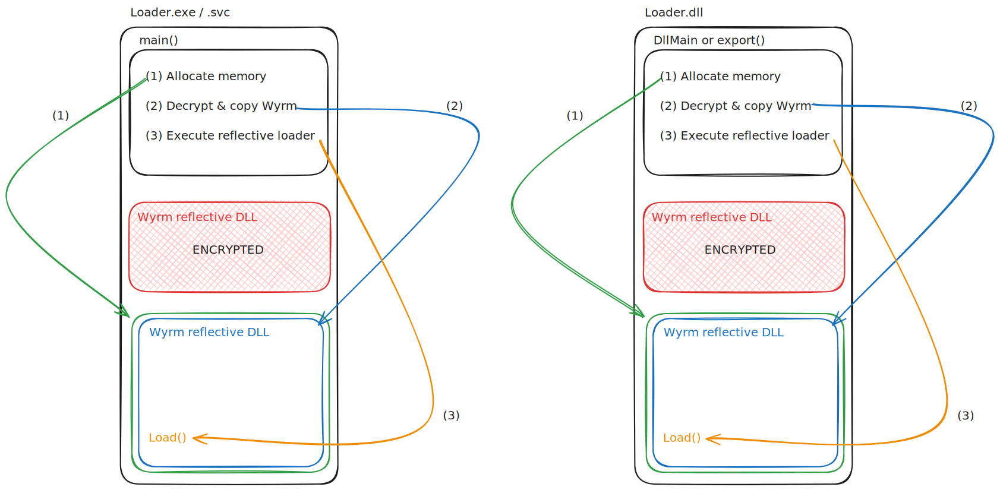

# Wyrm - v0.7 Hatchling

Wyrm (pronounced 'worm', an old English word for 'serpent' or 'dragon') is a post exploitation, open source, Red Team security testing framework framework, written in Rust designed to be used by Red Teams, Purple Teams, 
Penetration Testers, and general infosec hobbyists. This project is fully built in Rust, with extra effort going into obfuscating artifacts which
could be present in memory. Project created and maintained by [flux](https://github.com/0xflux/), for **legal authorised security testing only**.

Read the docs at https://docs.wyrm-c2.com/ for quick setup instructions. Or jump in to read about [customisable profiles](https://docs.wyrm-c2.com/implant/profiles/), 
[evasion](https://docs.wyrm-c2.com/implant/profiles/evasion.html), and [obfuscation](https://docs.wyrm-c2.com/implant/profiles/obfuscation.html). The docs
will be updated as the project grows and gains more capabilities.

Pre-release version. If you want to support this project, please give it a star! I will be releasing updates and
devlogs on my [blog](https://fluxsec.red/) and [YouTube](https://www.youtube.com/@FluxSec) to document progress, so please give me a follow there.

**IMPORTANT**: Before pulling updates, check the [Release Notes](https://github.com/0xflux/Wyrm/blob/master/RELEASE_NOTES.md) for any 
breaking changes to profiles / configs which you may need to manually adjust or migrate. This is done especially so that updates do not
overwrite your local configs and agent profiles.

## Post exploitation Red Team framework

Wyrm currently supports only HTTPS agents using a custom encryption scheme for encrypting traffic below TLS, with a unique packet design so that
the packets cannot be realistically decrypted even under firewall level TLS inspection.

Updates are planned through versions 1,0, 2.0, 3.0, and 4.0. You can view
the planned roadmap in this project (see [Milestones.md](https://github.com/0xflux/Wyrm/blob/master/Milestones.md)). In time, this is designed to be an open source competitor to **Cobalt Strike**, **Mythic**, **Sliver**, etc.

For any bugs, or feature requests, please use the Issues tab, and for anything else - please use GitHub Discussions. I am active on this project,
so I will be attentive to anything raised.

### Features

- Implant uses a configurable profile to customise features and configurations
- Fully reflective DLL model + a basic loader provided
- Access to raw binaries as well as ones prepared with a loader if you wish to use your own tooling with Wyrm
- Intuitive auto-DLL search order hijacking & sideloading features via profiles
- IOCs encrypted in the payload to assist in anti-analysis and anti-yara hardening
- Implant transmits data encrypted below TLS, defeating perimeter inspection security tools out the box
- Dynamic payload generation
- Easy mechanism to stage files (such as built implants, PDF, zip, etc) on the C2 for download to support phishing campaigns and initial attack vectors
- Supports native Windows API commands, more planned in future updates
- Easy to use terminal client for the operator to task & inspect agents, and to manage staged resources
- Implant uses the most common User-Agent for comms to help it blend in covertly with traffic by default, this is also configurable to suit your engagement
- Easy, automated C2 infrastructure deployment with docker
- Execute dotnet binaries in memory
- Anti-sandbox techniques which are highly configurable by the operator through profiles
- Backed by a database, fully timestamped to make reporting easier
- Proxy awareness (usable against clients who use proxies)

This project is not currently accepting contributions, please **raise issues** or use **GitHub Discussions** and I will look into them, and help
answer any questions.

### Loader

The Wyrm C2 comes with a loader for the reflective DLL component of the toolkit. The loader has the Wyrm postex payload encrypted in its 
.text section; for more information please see the [docs](https://docs.wyrm-c2.com/implant/rdll.html). Visually the loader runs as follows:

### Updates

**WARNING:** Before pulling an update; please check the [release notes](https://github.com/0xflux/Wyrm/blob/master/RELEASE_NOTES.md) to see whether there are any breaking changes - for example if the
**configurable C2 profile** changes in a breaking way from a previous profile you have, you will want to make sure you backup and migrate
your profile. I will be excluding `/c2/profiles/*` and `.env` from git once the project is published in pre-release to prevent accidentally overwriting
your previous profile when running `git pull` to update your software.

As per the roadmap, this project will see significant development over the next 12 months. To pull updates, whether they are new features
or bug fixes, you simply just do a **git pull**, re-build via docker: `docker compose up -d --build c2` and `docker compose up -d --build client`.

# The legal bit

## Authorized Use Only

**Permitted Users**

The Software is intended **exclusively** for **authorised** penetration testers, Red Teams, Purple Teams, hobbyists, and security researchers who have obtained **explicit, written authorisation from the owner of each target system**.

Any use of the Software on systems for which you do not hold such authorisation is **strictly prohibited** and may constitute a criminal offence under the UK Computer Misuse Act 1990 (including sections on Unauthorised access to computer material, Unauthorised access with intent to commit further offences, and Unauthorised acts impairing operation) or equivalent laws elsewhere.

## Prohibited Conduct
You must not use, distribute, or facilitate use of the Software for:

- Unauthorised Access (CMA 1990, Section 1) — hacking into systems or accounts without permission.
- Unauthorised Modification (CMA 1990, Section 3) — altering, deleting, or corrupting data or programs you have no right to modify.
- Denial-of-Service (CMA 1990, Section 3A) — disrupting or interrupting any service, network, or application.
- Malware/Ransomware Creation — writing, incorporating, or deploying code intended to extort, damage, or hold data hostage.
- Any other malicious, unlawful, or harmful activities.

Or equivalent offenses in other jurisdictions.

**No Encouragement of Misuse:**

The Author expressly **does not condone, support, or encourage** any illegal or malicious activity. This Software is provided purely for legitimate security-testing purposes, in environments where full authorisation has been granted.

## Compliance with Laws & Regulations

**Local Laws**: You alone are responsible for ensuring your use of the Software complies with all applicable local, national, and international laws, regulations, and corporate policies.

## No Warranty

The Software is provided “as is” and “as available”, without warranties of any kind, express or implied.

We make no warranty of merchantability, fitness for a particular purpose, or non-infringement.

We do not warrant that the Software is error-free, secure, or uninterrupted.

## Limitation of Liability

To the fullest extent permitted by law, neither the Author nor contributors shall be liable for any:

- Direct, indirect, incidental, special, punitive, or consequential damages.
- Loss of revenue, profits, data, or goodwill.
- Costs of procurement of substitute goods or services.

This limitation applies even if we have been advised of the possibility of such damages. It is the responsibility of the professional operator to
use this tool safely.